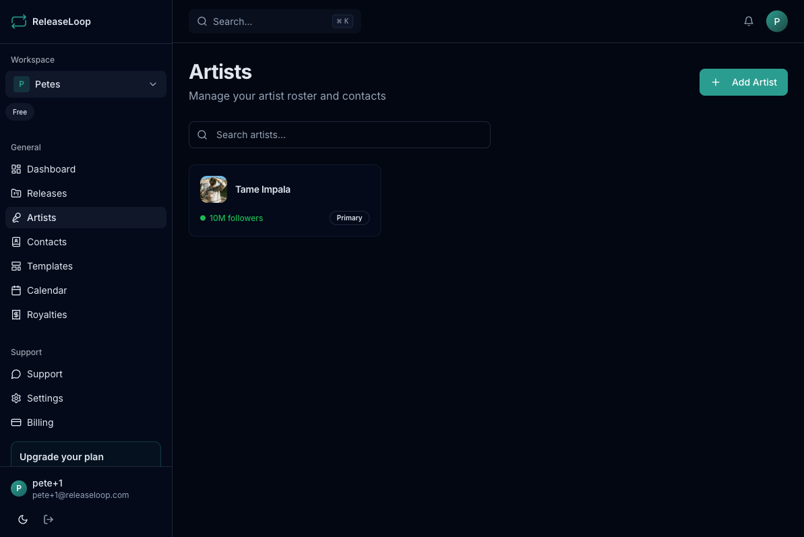
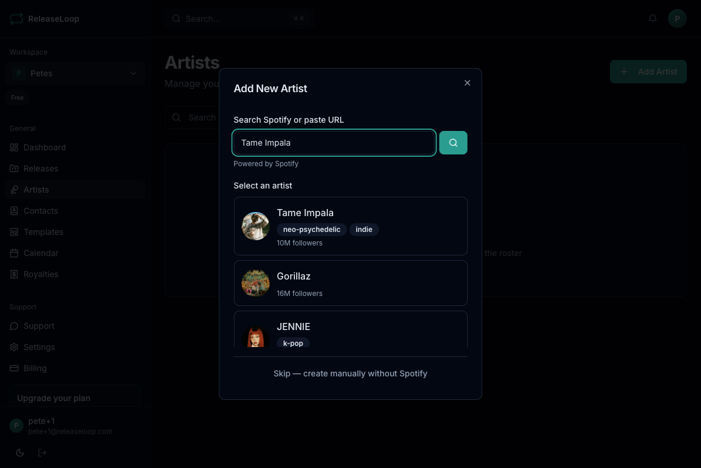
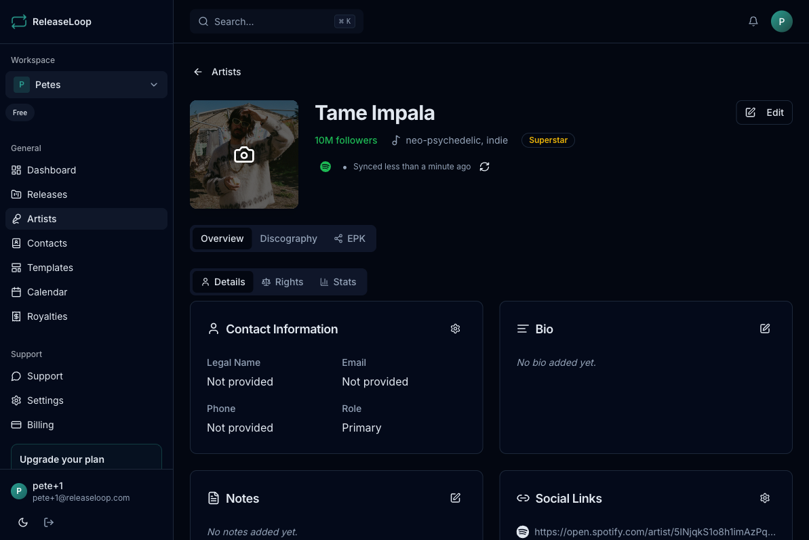

The Artists page is where you build and maintain your roster. Whether you run a label with dozens of acts or manage a handful of artists, every profile lives here -- enriched with live Spotify data and ready to attach to releases, EPKs, and royalty splits.

## Adding an artist

1. Go to the **Artists** page
2. Click **Add Artist**
3. Search for the artist on Spotify, or create a profile manually
4. If found on Spotify, the profile auto-populates with their photo, follower count, and popularity score

:::tip
Adding artists via Spotify search saves you from manual data entry and keeps profiles in sync with their public streaming presence -- useful when you need current stats for playlist pitches or booking submissions.
:::

## Artist profiles

Each artist profile stores the information you actually need day to day:

- **Name and photo** -- displayed across releases, EPKs, and anywhere the artist appears
- **Legal name** -- for contracts, royalty splits, and distributor metadata
- **Email and phone** -- so you can reach the artist or their manager directly
- **Bio** -- artist biography for EPKs, press releases, and pitching
- **Social links** -- Instagram, Spotify, SoundCloud, X (Twitter), website
- **Stats** -- Spotify followers and popularity score, auto-updated from the API

## Artist detail page

Click on any artist to open their detail page with three tabs:

### Overview
Core profile information, streaming stats, and contact details. Edit any field directly from this view -- update a legal name before a distribution deadline, add a new social link before an EPK goes out, or note a change in management.

### Discography
All releases featuring this artist. You can also import their Spotify discography to pre-populate your release catalog -- helpful when onboarding a new signing whose back catalog you need to track.

### EPK
The artist's [Electronic Press Kit](/artists/epks/) -- a public profile page you can share with booking agents, promoters, venues, press, and anyone who needs a professional overview of the artist.

## Spotify sync

Artists added via Spotify search are automatically enriched with:

- Profile photo
- Follower count
- Popularity score

These stats update so you always have current numbers when pitching to playlist curators, submitting festival applications, or pulling together marketing reports.

You can also bulk refresh all un-enriched artists from the Artists page using the **Refresh from Spotify** action.

See [Spotify Integration](/artists/spotify/) for more details.

## Deleting an artist

Artists can be deleted from their detail page, but only if they have no linked releases. Unlink the artist from all releases first if you need to remove them -- this prevents accidental loss of release history and royalty data.

## Plan limits

The number of artists you can add depends on your plan:

| Plan | Artist limit |
|------|-------------|
| **Solo** | 5 |
| **Team** | 25 |
| **Label** | Unlimited |
