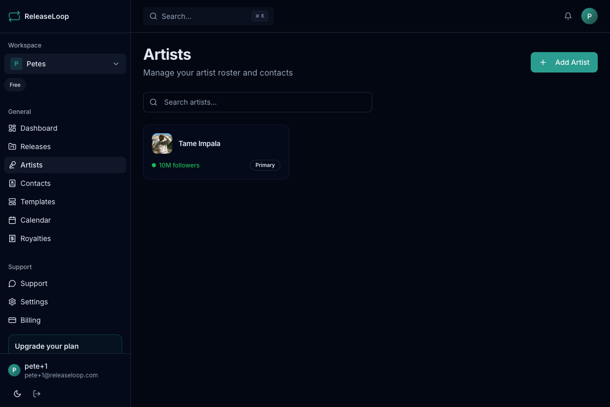
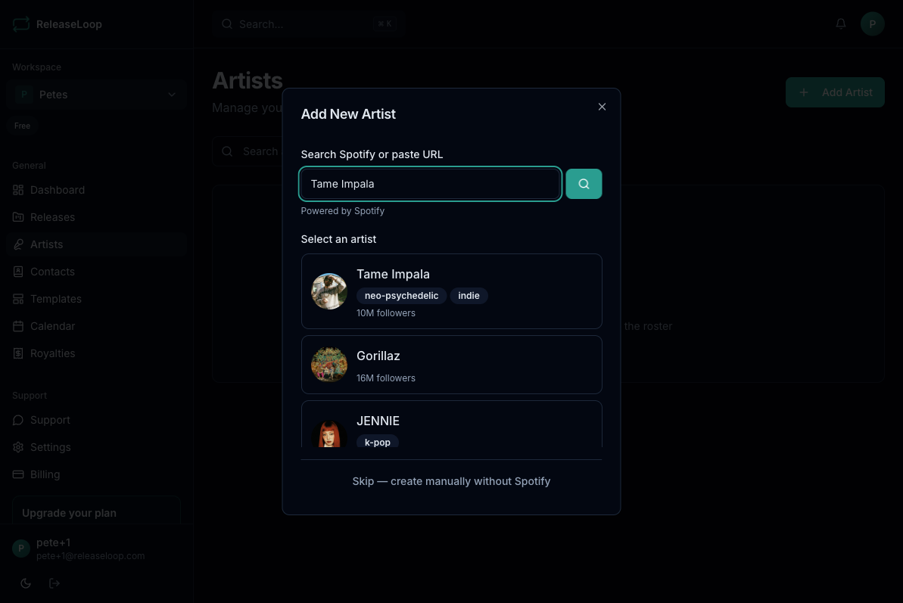
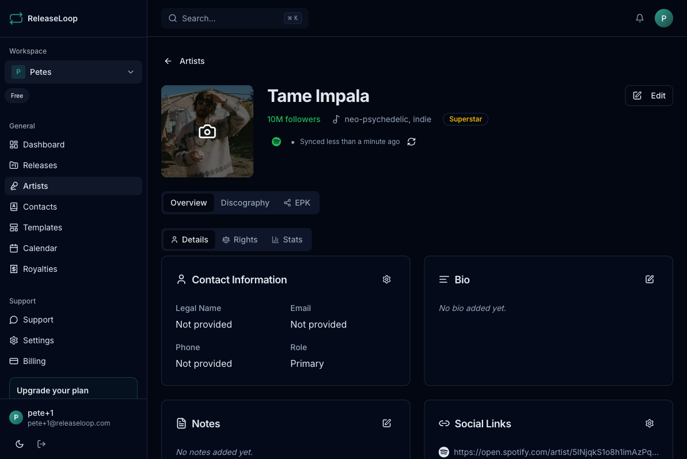

The Artists page is where you build and maintain your roster. Whether you run a label with dozens of acts or manage a handful of artists, every profile lives here -- enriched with live Spotify data and ready to attach to releases, EPKs, and royalty splits.

## Adding an artist

1. Go to the **Artists** page
2. Click **Add Artist**
3. Search for the artist on Spotify, or create a profile manually
4. If found on Spotify, the profile auto-populates with their photo, follower count, and popularity score

:::tip
Adding artists via Spotify search saves you from manual data entry and keeps profiles in sync with their public streaming presence -- useful when you need current stats for playlist pitches or booking submissions.
:::

## Artist profiles

Each artist profile stores the information you actually need day to day:

- **Name and photo** -- displayed across releases, EPKs, and anywhere the artist appears
- **Legal name** -- for contracts, royalty splits, and distributor metadata
- **Email and phone** -- so you can reach the artist or their manager directly
- **Home city** -- pick a real city from the built-in search (shown as "City, State, Country"), so your roster's locations are consistent and filterable
- **Bio** -- artist biography for EPKs, press releases, and pitching
- **Social links** -- Instagram, Spotify, SoundCloud, X (Twitter), website
- **Stats** -- Spotify followers and popularity score, auto-updated from the API

## Filtering and sorting your roster

On a bigger roster, the filter bar on the Artists page helps you find the right act fast:

- **Location** -- filter by the artist's home city
- **Followers** -- filter by Spotify follower bands
- **Genre** -- filter by genres pulled from Spotify
- **Role** -- filter by the artist's role

Sort by name, discography count, Spotify followers, recently added, popularity, or location. A result count under the filter bar shows how many artists match, and each artist card shows location and discography count at a glance.

## Artist detail page

Click on any artist to open their detail page with five tabs:

### Overview
Core profile information, streaming stats, and contact details, organized into **Details**, **Rights**, and **Stats** sections. Edit any field directly from this view -- update a legal name before a distribution deadline, add a new social link before an EPK goes out, or note a change in management.

The **Rights** section stores the artist's rights and publishing identifiers:

- **IPI** -- the artist's Interested Parties Information number
- **ISNI** -- International Standard Name Identifier
- **PRO affiliation** -- the performing rights organization they are registered with (ASCAP, BMI, PRS, GEMA, etc.)
- **Publisher** -- their publishing company
- **CAE/IPI Name Number**

Keep these filled in and you will never scramble for them when a distributor, sub-publisher, or sync licensor asks.

### Discography
All releases featuring this artist. You can also import their Spotify discography to pre-populate your release catalog -- helpful when onboarding a new signing whose back catalog you need to track.

### Tasks
Every task linked to this artist -- contract renewals, EPK refreshes, photoshoot bookings, and any release work you have attached to them. See [Tasks & Checklists](/releases/tasks/) for how artist tasks work.

### Support
A table of every contact who has supported or covered this artist -- the stations that played them, the blogs that featured them, the playlists that added them. Each row shows the contact, company, interaction type, coverage type, outcome, date, and a link to the coverage. Click **Log support** to add a new entry (the artist is pre-set; just pick the contact), or use the edit button on any row to tweak it without leaving the page. Entries here are the same records as the contact's interaction timeline. See [Tracking Interactions](/contacts/interactions/) for how support is logged.

### EPK
The artist's [Electronic Press Kit](/artists/epks/) -- a public profile page you can share with booking agents, promoters, venues, press, and anyone who needs a professional overview of the artist.

## Spotify sync

Artists added via Spotify search are automatically enriched with:

- Profile photo
- Follower count
- Popularity score

These stats update so you always have current numbers when pitching to playlist curators, submitting festival applications, or pulling together marketing reports.

You can also bulk refresh all un-enriched artists from the Artists page using the **Refresh from Spotify** action.

See [Spotify Integration](/artists/spotify/) for more details.

## Deleting an artist

Artists can be deleted from their detail page, but only if they have no linked releases. Unlink the artist from all releases first if you need to remove them -- this prevents accidental loss of release history and royalty data.

## Plan limits

The number of artists you can add depends on your plan:

| Plan | Artist limit |
|------|-------------|
| **Solo Lifetime** | 5 |
| **Label Lifetime** | 75 |
| **Agency / Pro Lifetime** | Unlimited |

See [Plans & Pricing](/billing/plans/) for full plan details.
