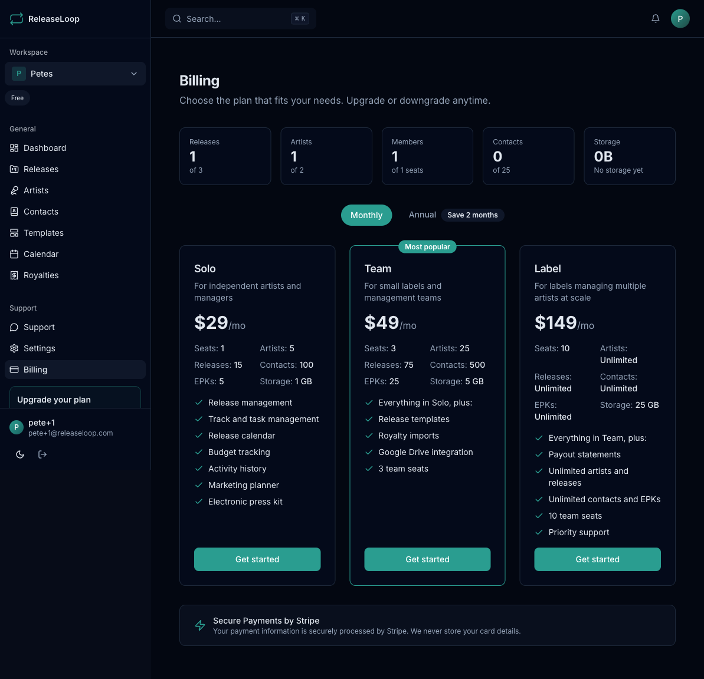

ReleaseLoop offers four subscription tiers designed for how the music industry actually works -- from solo artists managing their own releases to labels running a full roster.

## Plan comparison

| | Solo | Team | Label | Label Pro |
|---|---|---|---|---|
| **Monthly price** | $29/mo | $59/mo | $199/mo | $399/mo |
| **Annual price** | $290/yr | $590/yr | $1,990/yr | $3,990/yr |
| **Seats** | 1 | 3 | 10 | 25 |
| **Releases** | 15 | 30 | 150 | Unlimited |
| **Artists** | 5 | 15 | 75 | Unlimited |
| **Contacts** | 100 | 500 | 1,000 | Unlimited |
| **EPKs** | 5 | 25 | 50 | Unlimited |
| **Storage** | 1 GB | 5 GB | 25 GB | 100 GB |

## Feature availability by plan

### All plans include
- Release management (tracks, statuses, metadata, UPCs, ISRCs)
- Task management with assignments and due dates
- Calendar view
- Budget and expense tracking
- Activity history
- Marketing planner
- Electronic Press Kits (EPKs)
- Artist statements (Solo: 3 per quarter)

### Team plan adds
- **Unlimited artist statements** with custom statement branding
- **Release templates** -- standardize your rollout so every single follows the same proven plan
- **Royalty CSV imports** -- pull in distributor statements from DistroKid, TuneCore, CD Baby, or any other distributor and match them to your catalog
- **Google Drive integration** -- browse your folders of master WAVs, artwork, and promo assets directly from the release page
- 3 seats

### Label plan adds
- **Payout statements** -- generate statements so you can settle with your artists quarterly, monthly, or on whatever schedule you agree to
- 150 releases, 75 artists, 1,000 contacts, 50 EPKs
- 10 team seats
- **Priority support** -- faster response times when you need help

### Label Pro plan adds
- **Unlimited** releases, artists, contacts, and EPKs
- 25 team seats
- 100 GB storage
- **Dedicated support**

## Annual billing

Save approximately 2 months by switching to annual billing. Annual plans are billed once per year at the discounted rate shown above.

## Which plan is right for you

- **Solo** -- you are an independent artist managing your own releases, or a manager with a small roster. You handle everything yourself and need a clean system to track your rollouts, tasks, and marketing.
- **Team** -- you run a small label or management company with a couple of collaborators. You need templates to keep your process consistent, royalty imports to track what your distributors pay out, and Google Drive integration to keep assets organized.
- **Label** -- you are an established label with a real team and artists who expect proper accounting. You need payout statements to settle with your roster and seats for your A&R, marketing, and operations staff.
- **Label Pro** -- you run a large label with an extensive roster. You need unlimited everything, a bigger team, and dedicated support.
