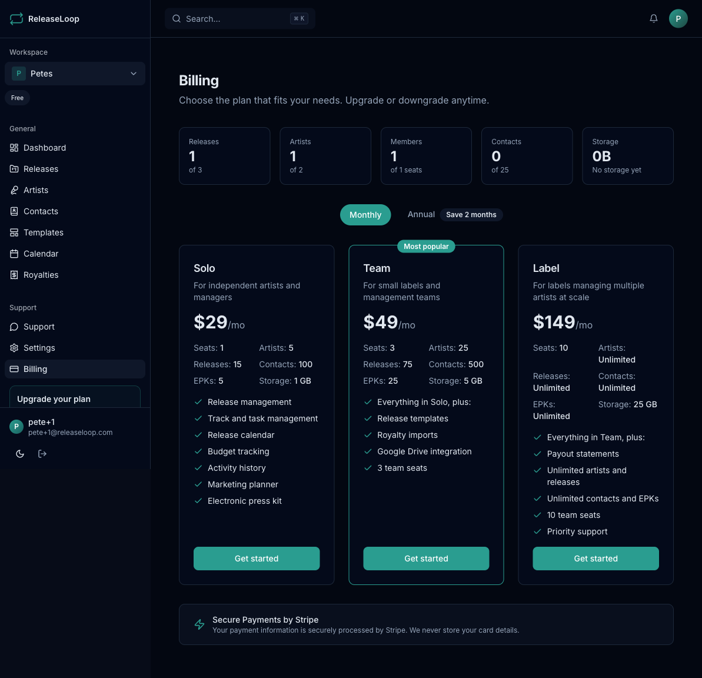

ReleaseLoop is sold as a **lifetime deal**: pay once, keep access forever. Three tiers cover how the music industry actually works -- from solo artists managing their own releases to agencies running a full roster.

## Plan comparison

| | Solo Lifetime | Label Lifetime | Agency / Pro Lifetime |
|---|---|---|---|
| **Price** | $149 one-time | $299 one-time | $499 one-time |
| **Seats** | 1 | 3 | 10 |
| **Releases** | 15 | 150 | Unlimited |
| **Artists** | 5 | 75 | Unlimited |
| **Contacts** | 100 | 1,000 | Unlimited |
| **EPKs** | 5 | 75 | Unlimited |
| **Storage** | 1 GB | 25 GB | 100 GB |

## Feature availability by plan

### All plans include
- Release management (tracks, statuses, metadata, UPCs, ISRCs)
- Task management with assignments, due dates, and subtask checklists
- Calendar view
- Budget and expense tracking
- Activity history
- Marketing planner
- Electronic Press Kits (EPKs)
- Artist statements (Solo: 3 per quarter)

### Label Lifetime adds
- **Unlimited artist statements** with custom statement branding
- **Release templates** -- standardize your rollout so every single follows the same proven plan
- **Royalty CSV imports** -- pull in distributor statements from DistroKid, TuneCore, CD Baby, or any other distributor and match them to your catalog
- **Google Drive integration** -- browse your folders of master WAVs, artwork, and promo assets directly from the release page
- 3 team seats

### Agency / Pro Lifetime adds
- **Payout statements** -- generate statements so you can settle with your artists quarterly, monthly, or on whatever schedule you agree to
- **Unlimited** releases, artists, contacts, and EPKs
- 10 team seats
- **Priority support** -- faster response times when you need help

## Upgrading between tiers

You can upgrade to a higher tier at any time by paying the difference between your current plan and the new one. Your data, settings, and team stay exactly as they are -- only your limits and features change.

## Add-ons

Need more capacity without changing tiers? Lifetime workspaces can buy **additional team seats** as a one-time purchase from the **Billing** page. See [Team Members & Roles](/team/members/) for how seat limits work.

## Which plan is right for you

- **Solo Lifetime** -- you are an independent artist managing your own releases, or a manager with a small roster. You handle everything yourself and need a clean system to track your rollouts, tasks, and marketing.
- **Label Lifetime** -- you run a label or management company with collaborators and artists who expect proper accounting. You need templates to keep your process consistent, royalty imports to track what your distributors pay out, and seats for your team.
- **Agency / Pro Lifetime** -- you run an agency or larger label with an extensive roster. You need unlimited catalog, payout statements to settle with artists, a bigger team, and priority support.
