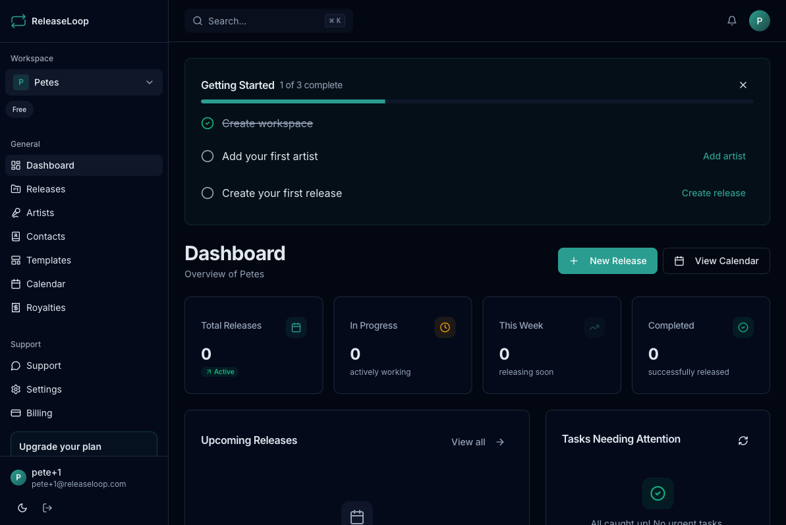

When you first sign up for ReleaseLoop, you'll walk through a four-step onboarding flow that sets up your workspace and gets your first release on the board. The whole thing takes a couple of minutes.

## Step 1: Workspace setup

- **Name your workspace** -- this is the home base for your operation. If you run a label, use the label name. If you manage artists, use your company name. If you're an independent artist, your project or artist name works great.
- **Select your role** -- label, artist manager, artist, distributor, PR/marketing, or other. This helps ReleaseLoop tailor the experience to how you work.

Your workspace is the shared space where all your releases, artists, contacts, and team members live. Everyone you invite will see the same data, filtered by the permissions you set.

## Step 2: Add your first artist

You have two options:

- **Search Spotify** -- type an artist name and select the right profile. ReleaseLoop will pull in their profile photo, monthly listener count, and popularity score automatically. This keeps your roster up to date without manual data entry.
- **Create manually** -- if the artist isn't on Spotify yet (maybe this is a debut release), just type in their name and fill in what you have.

You can always add more artists later. If you manage a roster of ten or fifty artists, you'll build that out from the Artists page after onboarding.

## Step 3: Create your first release

Fill in the basics for your next drop:

- **Title** -- the release name as it will appear on streaming platforms
- **Artists** -- select from the artists you've added to your workspace
- **Release date** -- the day the music goes live on DSPs. This anchors your entire timeline -- distributor submission deadlines, playlist pitch windows, and marketing phases all work backward from here.
- **Type** -- single, EP, or album

Don't worry about getting every detail right at this stage. You can update everything later, add tracks with ISRC codes, set budgets, and build out your full campaign from the release detail page.

## Step 4: Plan marketing

Kick off your rollout by adding initial marketing activities to the release:

- **Choose platforms** -- Instagram, TikTok, Spotify, YouTube, press outlets, or wherever your audience lives
- **Set the phase** -- pre-save, release week, or post-release. This helps you see at a glance what needs to happen and when.
- **Add descriptions** -- note the specifics: "Post teaser clip to TikTok with pre-save link", "Submit to Spotify editorial via Spotify for Artists", "Send press release to playlist curators"

You can add, edit, and rearrange marketing activities anytime from the release's Marketing tab.

## After onboarding

Once you've completed the flow, you'll land on your **Dashboard**:

- **Release statistics** -- a snapshot of where things stand across your active releases
- **Upcoming releases** -- your next drops at a glance, so you always know what's coming
- **Onboarding checklist** -- tracks remaining setup steps like inviting team members and connecting integrations
- **Quick actions** -- jump straight into creating a new release or adding an artist

The onboarding checklist stays on your dashboard until you've completed all the setup steps, then it gets out of your way.
