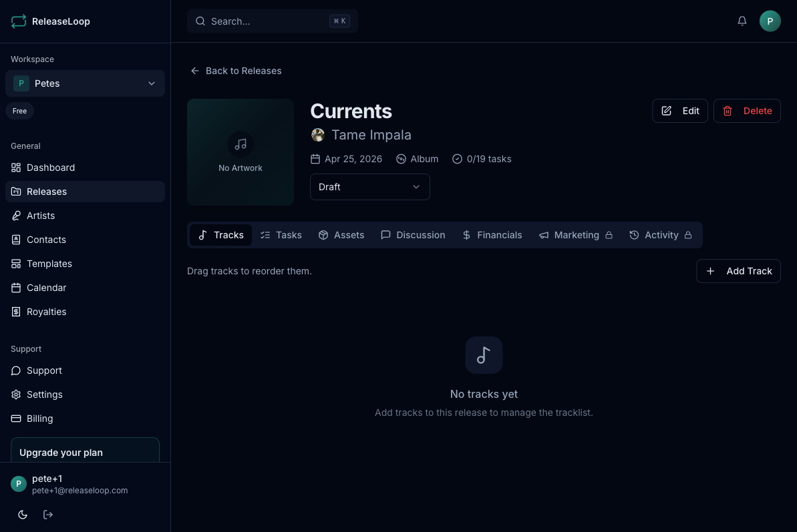

This guide gets you from sign-up to your first release as fast as possible -- so you can start planning your next drop.

## 1. Create your account

Sign up at [app.releaseloop.com](https://app.releaseloop.com) using your email or sign in with Google or GitHub. After verifying your email, you'll be taken through the onboarding flow.

## 2. Set up your workspace

During onboarding, you'll:

1. **Name your workspace** -- use your label name, management company, or artist project name so your team knows where they are
2. **Select your role** -- label, artist manager, artist, distributor, PR/marketing, or other
3. **Add your first artist** -- search Spotify to pull in their profile photo, monthly listeners, and popularity score automatically, or create the profile by hand
4. **Create your first release** -- give it a title, assign your artist, set the release date, and pick the format (single, EP, or album)

## 3. Build out your release

Once your release is created, the release detail page is your command center. Use the tabs to fill in everything you need before your distributor deadline:

| Tab | What it does |
|-----|-------------|
| **Tracks** | Add each song with its ISRC code and artist credits -- essential for matching royalties later |
| **Tasks** | Build your release checklist: submit to distributor, pitch to Spotify editorial, send press servicing, schedule social content, set up pre-save link |
| **Financials** | Set a release budget and track expenses like mixing, mastering, artwork, and PR costs |
| **Marketing** | Plan your rollout -- playlist pitches, Instagram Reels, TikTok teasers, press outreach, and anything else in your campaign |
| **Assets** | Upload cover artwork, press photos, and stems, or connect Google Drive for your existing folders |
| **Comments** | Discuss the release with your team -- tag your A&R or marketing lead to get sign-off |

## 4. Invite your team

Go to **Settings > Team Members** and invite collaborators by email. Whether it's your label partner, a marketing intern, or your artist's manager -- assign roles to control what each person can see and do.

## 5. Explore more features

- Use **Templates** to save your go-to release checklist and reuse it every time you set up a new single or album campaign
- Check the **Calendar** for a timeline view of all your upcoming releases -- helpful when you're spacing out drops across your roster
- Import **Royalty CSVs** from your distributor (DistroKid, TuneCore, CD Baby, or others) to track revenue by release and see what you owe your artists
- Build **EPKs** as polished public profiles you can send to promoters, booking agents, and press

For a detailed walkthrough of each onboarding step, see [Onboarding Walkthrough](/getting-started/onboarding/).
