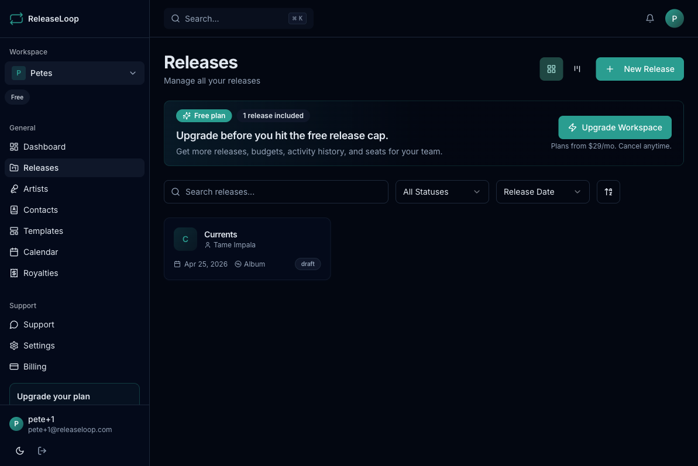
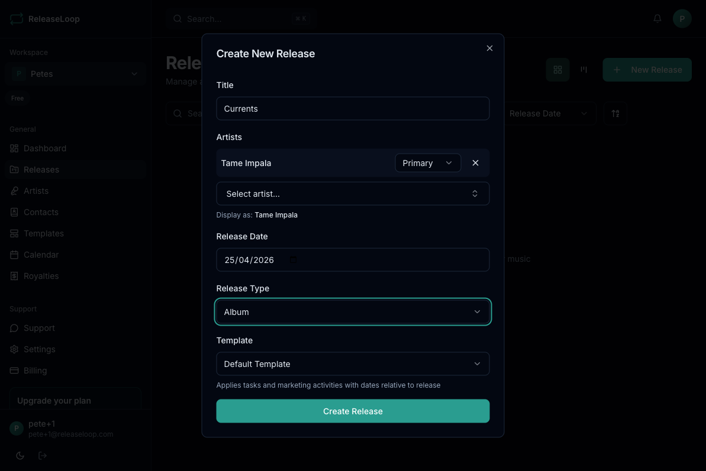

Releases are the core of ReleaseLoop. Each release represents a single, EP, or album and acts as the central hub for everything that needs to happen before, during, and after drop day -- tracks, tasks, marketing plans, financials, and assets all live here.

## Creating a release

Whether you are setting up a new single for an emerging artist or building out a full album campaign, the process starts the same way:

1. Click **New Release** from the releases page or dashboard
2. Fill in the details:
   - **Title** -- the release name as it will appear on DSPs
   - **Primary artist(s)** -- select from your artist roster
   - **Release date** -- the planned street date (you can adjust this later if mastering or distributor timelines shift)
   - **Type** -- Single, EP, or Album
   - **UPC** -- the Universal Product Code assigned by your distributor (add it now or fill it in once you receive it from DistroKid, TuneCore, CD Baby, etc.)
   - **Catalogue number** -- your label's internal reference, useful for tracking across distributor dashboards and royalty statements
3. Click **Create**

## Viewing releases

The releases page gives you two ways to see your pipeline:

- **Grid view** -- card layout showing cover art, title, status, artists, and release date. Great for scanning what is coming up across your roster.
- **Board view** -- Kanban-style columns organized by release status. Drag releases between columns to update their stage, or use the board to spot bottlenecks -- for example, too many releases stuck in Draft while release dates are approaching.

Use the search bar and filters to find specific releases by artist, status, or date range.

## Release statuses

Releases move through workflow statuses that mirror how a release actually progresses:

| Status | When to use it |
|--------|----------------|
| **Draft** | You are still finalizing the tracklist, artwork, or metadata -- nothing has been submitted to your distributor yet |
| **Scheduled** | Everything is locked in and delivered to your distributor. The release date is confirmed and you are in the marketing rollout phase. |
| **Released** | The music is live on Spotify, Apple Music, and other platforms |
| **Archived** | The campaign is wrapped up, or the release was shelved |

## Editing a release

Click on any release to open its detail page. From there you can:

- Update metadata like title, artists, dates, UPC, and catalogue number -- handy when your distributor assigns a UPC after delivery or the street date shifts
- Change the release status as the campaign progresses
- Set or swap the cover art
- Access all tabs: Tracks, Tasks, Financials, Royalties, Marketing, Assets, Comments, and Activity

## Deleting a release

Releases can be deleted by workspace admins from the release detail page. This removes the release and all associated data permanently -- use this for duplicate entries or test releases, not for archiving completed campaigns.

## Release detail tabs

Each release has dedicated tabs for managing different aspects of the campaign:

- [Tracks](/releases/tracks/) -- the songs on the release, with ISRCs for royalty matching
- [Tasks](/releases/tasks/) -- your release checklist, from mastering deadlines to distributor delivery
- [Financials](/financials/budgets/) -- budget and revenue tracking
- [Marketing](/releases/marketing/) -- your promotional rollout across social, DSPs, press, and email
- [Assets](/releases/assets/) -- artwork, master WAVs, promo photos, and other files
- [Comments](/releases/comments/) -- team discussion and a full activity log
