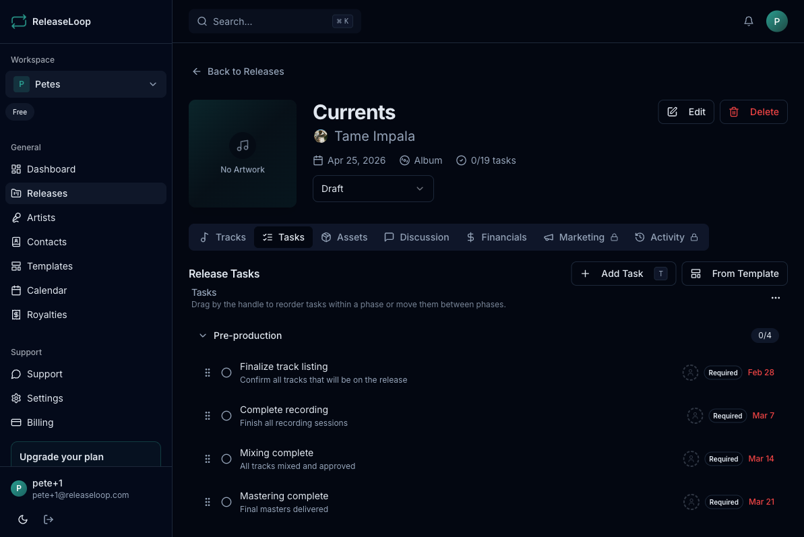

The **Tasks** tab on a release is your checklist for everything that needs to happen before, during, and after drop day. Whether it is booking mastering, submitting to your distributor, pitching Spotify editorial playlists, or scheduling social content -- it all lives here.

## Creating tasks

1. Open a release and go to the **Tasks** tab
2. Click **Add Task** or press **T** as a keyboard shortcut
3. Fill in:
   - **Title** -- what needs to happen (e.g., "Submit final masters to DistroKid," "Send press release to blog contacts," "Schedule Instagram teaser 2 weeks before drop day")
   - **Assignee** -- which team member is responsible (optional). On a label, you might assign distributor delivery to your ops person, playlist pitching to your marketing lead, and artwork approval to the artist's manager.
   - **Due date** -- when it should be completed (optional). Work backwards from your release date -- most distributors need assets 3-4 weeks before street date, and Spotify editorial pitching opens 4 weeks out.
   - **Priority** -- the importance level

## Working with tasks

- **Mark complete** -- check off tasks as they are done
- **Reorder** -- drag and drop tasks to change their priority order
- **Assign** -- tasks are color-coded by assignee for easy scanning across a busy release
- **Bulk actions** -- mark all tasks complete or delete all at once

## Importing from templates

If you have [release templates](/templates/release-templates/) set up, you can import a full task checklist into any release in seconds:

1. Go to the Tasks tab
2. Click **Import from Template**
3. Select a template
4. All template tasks will be added to the release

This is a huge time saver when you follow a consistent release process. Set up a template once with your standard steps -- mastering, distributor delivery, metadata review, playlist pitching, social rollout, press outreach -- and apply it to every new release.

## Task notifications

When notifications are enabled, team members receive alerts for:

- Being assigned to a task
- Tasks due within 24 hours
- Overdue tasks

Configure notification preferences in **Settings > Notifications**. This is especially useful when multiple people are involved in a campaign and you need to make sure deadlines for distributor submissions or marketing milestones do not slip.

## Tips

- Use templates to standardize your release workflow so every release gets the same level of attention
- Assign tasks to specific team members so nothing falls through the cracks -- especially critical steps like submitting metadata or clearing samples
- The dashboard shows urgent tasks across all releases in one place, so you can see at a glance what needs attention today across your entire roster
