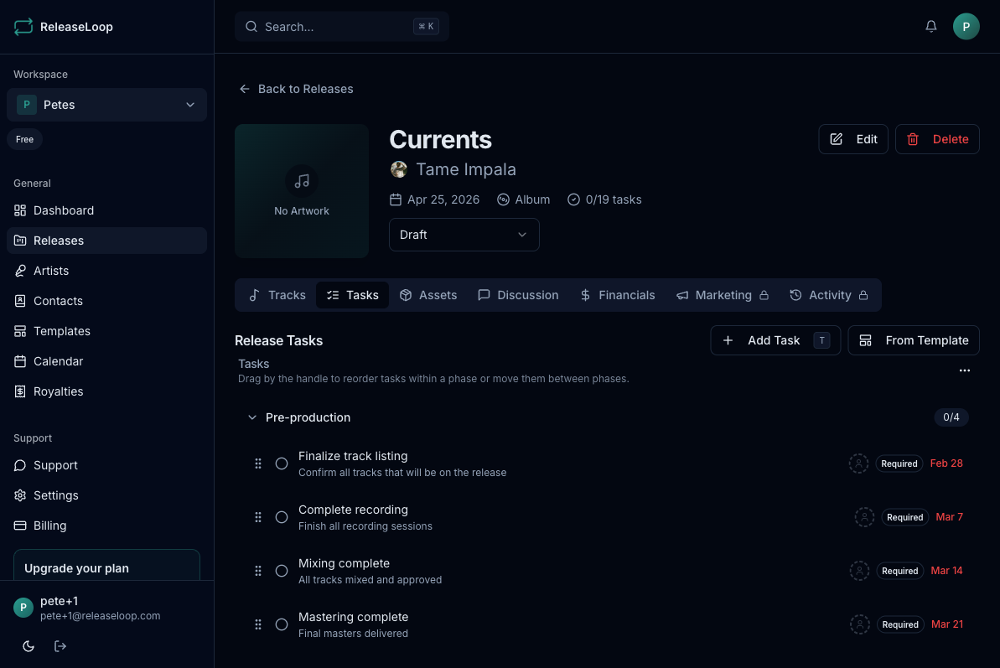

Tasks are how work gets done in ReleaseLoop. Whether it is booking mastering, submitting to your distributor, pitching Spotify editorial playlists, or chasing a contract back from a manager -- it all lives in tasks.

A task can be linked to a **release**, an **artist**, a **contact**, or nothing at all. Release checklists still live on the release's **Tasks** tab, but you are no longer limited to release work: create a standalone to-do for artist-management admin, or a follow-up tied to a contact, and see everything together on the Tasks page.

## The Tasks page

The **Tasks** page in the sidebar shows every task in your workspace, in two views:

- **List** -- tasks grouped by due date, so today's deadlines float to the top
- **Board** -- a kanban board for dragging tasks through statuses

Narrow things down with the filter bar: **Artist**, **Release**, **Contact**, **Assignee**, and **Status** filters, plus a **My tasks** toggle that shows only work assigned to you. The **Subtasks** toggle expands or collapses every checklist at once.

Clicking a task anywhere in the app opens it in the task editor, where you can update it, re-link it to a different release, artist, or contact, or delete it.

## Task contexts

When creating a task you choose what it is attached to:

- **Release** -- classic release checklist work. These tasks also appear on the release's Tasks tab.
- **Artist** -- roster work that is not tied to one release: renegotiate a contract, update an EPK, book a photoshoot. These appear on the artist's **Tasks** tab too.
- **Contact** -- follow-ups tied to a person or company: chase a playlist curator, reply to a booking inquiry.
- **None** -- a general workspace to-do.

You can re-link a task between contexts at any time from the task editor.

Tasks with a due date also appear on the [Calendar](/templates/calendar/), alongside release dates and marketing activities.

## Creating tasks

From a release:

1. Open a release and go to the **Tasks** tab
2. Click **Add Task** or press **T** as a keyboard shortcut

Or from the Tasks page, where the create dialog lets you pick the context (release, artist, contact, or none).

Fill in:

- **Title** -- what needs to happen (e.g., "Submit final masters to DistroKid," "Send press release to blog contacts," "Schedule Instagram teaser 2 weeks before drop day")
- **Assignee** -- which team member is responsible (optional). On a label, you might assign distributor delivery to your ops person, playlist pitching to your marketing lead, and artwork approval to the artist's manager.
- **Due date** -- when it should be completed (optional). Work backwards from your release date -- most distributors need assets 3-4 weeks before street date, and Spotify editorial pitching opens 4 weeks out.
- **Priority** -- the importance level

## Working with tasks

- **Mark complete** -- check off tasks as they are done
- **Reorder** -- drag and drop tasks to change their priority order
- **Assign** -- tasks are color-coded by assignee for easy scanning across a busy release
- **Bulk actions** -- mark all tasks complete or delete all at once

## Subtasks (checklists on a task)

Big tasks usually hide several smaller steps. A task like "Record music video" might involve finding a location, doing a trial run, picking outfits, and storyboarding. Instead of cluttering your task list, add those steps as a checklist on the task itself:

1. Open a task (click it in any task list)
2. In the **Checklist** section, type an item and press **Enter** -- or paste a multi-line list to add several items at once
3. Tick items off as you go; drag to reorder, click an item's text to rename it

Tasks with a checklist show a progress chip (e.g. **2/5**) in every task list. Click the chip to expand the checklist inline and tick items without opening the task. On the Tasks page, the **Subtasks** toggle in the filter bar expands or collapses every checklist at once.

If a checklist item grows into something bigger, hover it and use **Convert to task** -- it becomes a standalone task linked to the same release, artist, or contact. Duplicating a task also copies its checklist (with all items reset to unticked).

## Importing from templates

If you have [release templates](/templates/release-templates/) set up, you can import a full task checklist into any release in seconds:

1. Go to the Tasks tab
2. Click **Import from Template**
3. Select a template
4. All template tasks will be added to the release

This is a huge time saver when you follow a consistent release process. Set up a template once with your standard steps -- mastering, distributor delivery, metadata review, playlist pitching, social rollout, press outreach -- and apply it to every new release.

## Task notifications

When notifications are enabled, team members receive alerts for:

- Being assigned to a task
- Tasks due within 24 hours
- Overdue tasks

Configure notification preferences in **Settings > Notifications**. This is especially useful when multiple people are involved in a campaign and you need to make sure deadlines for distributor submissions or marketing milestones do not slip.

## Tips

- Use templates to standardize your release workflow so every release gets the same level of attention
- Assign tasks to specific team members so nothing falls through the cracks -- especially critical steps like submitting metadata or clearing samples
- The dashboard shows urgent tasks across all releases in one place, so you can see at a glance what needs attention today across your entire roster
- Use artist tasks for roster admin that has no release attached -- contract renewals, EPK refreshes, photoshoot bookings -- so it stops living in your head or a separate notes app
