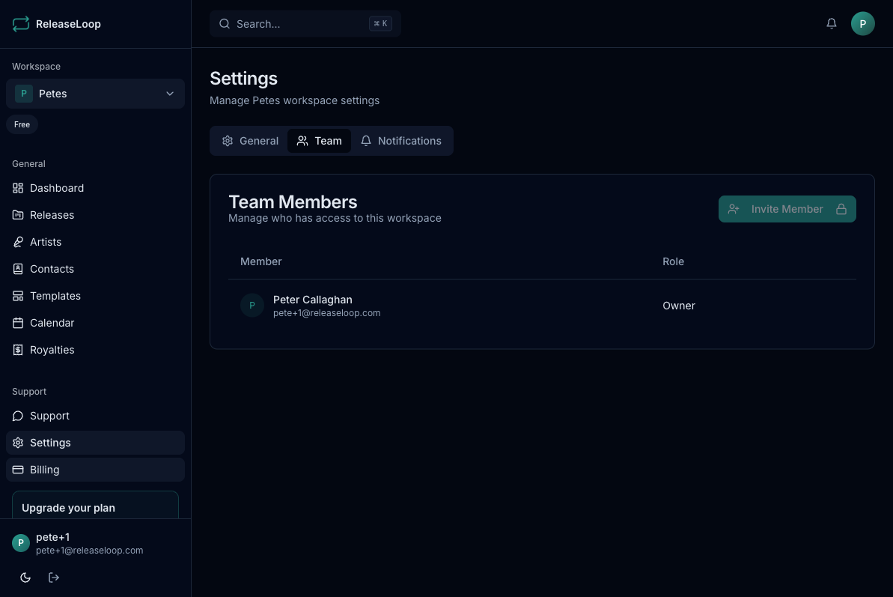

ReleaseLoop is built for teams. Invite your A&R, marketing, publicists, and management staff into your workspace so everyone works from the same release schedule and artist roster.

## Inviting team members

1. Go to **Settings > Team Members**
2. Click **Invite Member**
3. Enter their email address
4. Select their role
5. They will receive an email invitation to join your workspace

You can also generate a **shareable invite link** -- useful when onboarding a new hire or bringing a freelance publicist into the workspace.

## Roles

Each team member is assigned a role that controls what they can see and do. This lets you give your A&R team access to releases without them seeing financials, or let your publicist manage marketing activities without touching release metadata.

| Role | What they can do |
|------|-----------------|
| **Owner** | Full control -- billing, team management, all features. Typically the label owner or lead manager. |
| **Admin** | Manage releases, artists, contacts, and team members. Your operations lead or label manager. |
| **A&R** | Manage releases and artists. Perfect for A&R reps who need to update metadata, manage tracks, and work with the roster. |
| **Marketing** | Manage marketing activities. Your publicist, social media manager, or promo coordinator only needs this. |
| **Member** | View access with basic edits. Good for interns, consultants, or anyone who needs visibility without full control. |

## Managing members

From **Settings > Team Members** you can:

- View all current members and their roles
- Change a member's role -- e.g., promote someone from Member to A&R as they take on more responsibility
- Remove a member from the workspace -- they immediately lose access to all data
- See pending invitations
- Revoke unaccepted invitations

## Seat limits

The number of team members depends on your plan:

| Plan | Seats |
|------|-------|
| **Solo** | 1 |
| **Team** | 3 |
| **Label** | 10 |
| **Label Pro** | 25 |

If you need to add more people than your plan allows, you will need to upgrade. Solo artists working alone are covered on the Solo plan. Small teams with a couple of collaborators fit on Team. Labels with A&R, marketing, operations, and management staff should look at the Label or Label Pro plan.

## Joining via invitation

When someone receives an invite:

1. They click the link in the invitation email (or the shareable link)
2. If they do not have a ReleaseLoop account, they create one
3. They are added to the workspace with the assigned role
4. The workspace appears in their workspace switcher -- they can start working immediately
