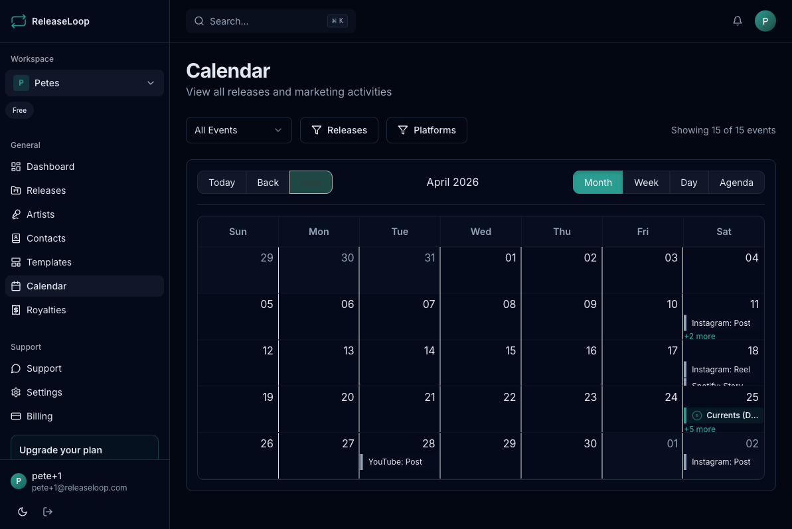

The Calendar page gives you a visual timeline of all your releases and marketing activities.

## Views

The calendar supports two views:

- **Month view** -- see the full month at a glance
- **Week view** -- zoom in on a specific week for more detail

## What appears on the calendar

- **Release dates** -- shown with the release cover art and title
- **Marketing activities** -- promotional activities with scheduled dates

Hover over any item to see a quick info card with details like artwork, title, and type.

## Filtering

Filter calendar events by type:

- Show only releases
- Show only marketing activities
- Show both (default)

## Navigation

- Click on any release to go directly to its detail page
- Use arrow buttons to move between months or weeks
- Click "Today" to jump back to the current date

## Tips

- Use the calendar alongside the marketing planner to ensure your promotional activities are evenly distributed
- The month view is great for spotting release date conflicts
- Marketing activities from all releases appear together, making it easy to see your overall promotional schedule
