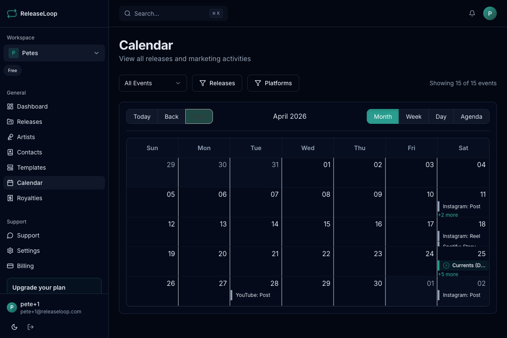

The Calendar page gives you a bird's-eye view of every release date, marketing activity, and dated task across your roster. Instead of flipping between spreadsheets and distributor dashboards, you see everything in one place.

## Views

The calendar supports two views:

- **Month view** -- see the full month at a glance. This is where you spot problems like two releases dropping the same week or a month with nothing scheduled.
- **Week view** -- zoom into a specific week to check that your marketing activities are properly spaced. If you have a single dropping Friday, you can see whether pre-save posts, playlist pitches, and press outreach are all queued up.

## What appears on the calendar

- **Release dates** -- shown with the release cover art and title, so you can visually scan your schedule
- **Marketing activities** -- every promotional activity with a scheduled date, across all releases
- **Tasks** -- every task with a due date, whether it is linked to a release, an artist, a contact, or standalone. See [Tasks & Checklists](/releases/tasks/).

Hover over any item to see a quick info card. Clicking a task opens it in the task editor; clicking a release jumps to its detail page.

## Filtering

- **Event type** -- show everything, or only releases, only marketing activities, or only tasks
- **Task context** -- when looking at tasks, narrow to release tasks, artist tasks, contact tasks, or workspace tasks
- **Release** -- limit the calendar to one or more specific releases
- **Assignee and status** -- narrow tasks to a specific team member or status

## Navigation

- Click on any release to jump directly to its detail page
- Use arrow buttons to move between months or weeks
- Click "Today" to jump back to the current date

## Subscribe from your own calendar app

Click **Subscribe** on the Calendar page to create a personal calendar feed you can add to Google Calendar, Apple Calendar, Outlook, or any app that supports iCal subscriptions:

1. Click **Subscribe** in the calendar toolbar
2. Choose what the feed should include -- releases, marketing activities, tasks, or any combination
3. Copy the feed URL and paste it into your calendar app as a subscribed calendar

The feed only ever contains events you are authorized to see, and the URL is tied to your account. If the URL leaks, regenerate it from the same dialog -- the old link stops working immediately.

## How to use it effectively

- **Avoid release collisions.** If you are running a label or managing multiple artists, the month view immediately shows when you have two releases competing for the same week. Spread them out so each project gets proper attention.
- **Spot gaps in your marketing timeline.** A release with no marketing activities in the two weeks before drop day is a missed opportunity. The calendar makes gaps obvious.
- **Coordinate across your roster.** Marketing activities from all releases appear together, so you can see your overall promotional workload and make sure your team is not overloaded in any given week.
- **Keep deadlines in your daily driver.** Subscribe to the feed from the calendar app you actually look at every morning, so distributor deadlines and task due dates show up next to your meetings.
